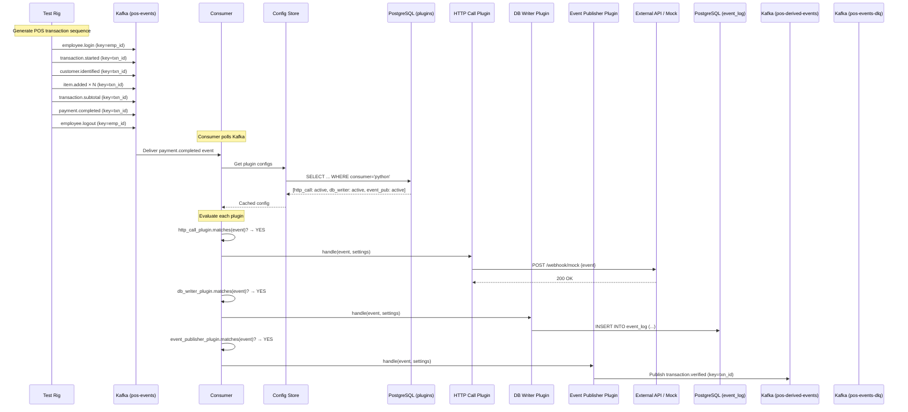
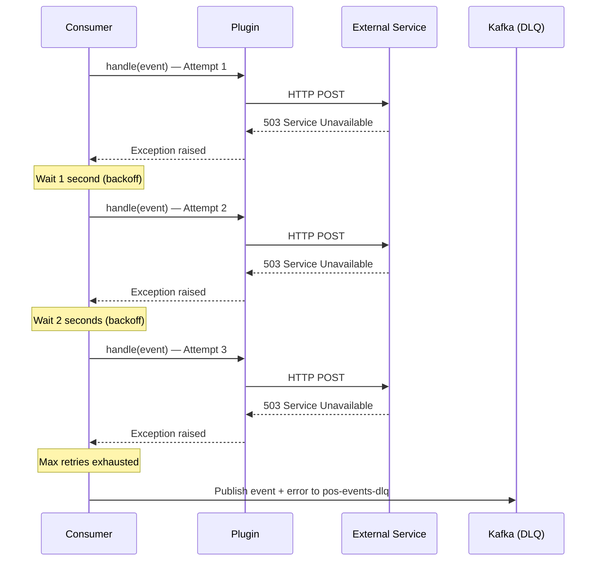
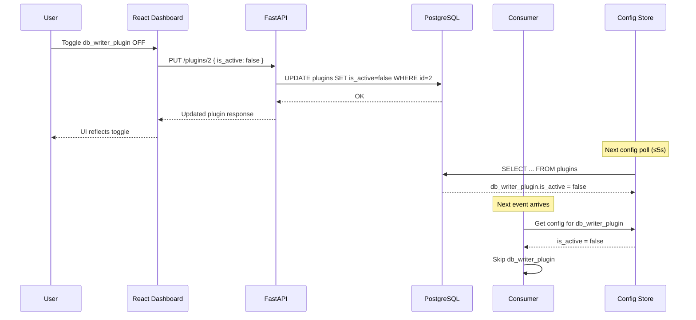

# Sequence Diagrams

## Full Event Flow: Generator → Consumer → Plugins → Actions

```mermaid
sequenceDiagram
    participant GEN as Test Rig
    participant K as Kafka (pos-events)
    participant C as Consumer
    participant CS as Config Store
    participant PG as PostgreSQL (plugins)
    participant HP as HTTP Call Plugin
    participant DP as DB Writer Plugin
    participant EP as Event Publisher Plugin
    participant EXT as External API / Mock
    participant DB as PostgreSQL (event_log)
    participant DK as Kafka (pos-derived-events)
    participant DLQ as Kafka (pos-events-dlq)

    Note over GEN: Generate POS transaction sequence

    GEN->>K: employee.login (key=emp_id)
    GEN->>K: transaction.started (key=txn_id)
    GEN->>K: customer.identified (key=txn_id)
    GEN->>K: item.added × N (key=txn_id)
    GEN->>K: transaction.subtotal (key=txn_id)
    GEN->>K: payment.completed (key=txn_id)
    GEN->>K: employee.logout (key=emp_id)

    Note over C: Consumer polls Kafka

    K->>C: Deliver payment.completed event

    C->>CS: Get plugin configs
    CS->>PG: SELECT ... WHERE consumer='python'
    PG-->>CS: [http_call: active, db_writer: active, event_pub: active]
    CS-->>C: Cached config

    Note over C: Evaluate each plugin

    C->>C: http_call_plugin.matches(event)? → YES
    C->>HP: handle(event, settings)
    HP->>EXT: POST /webhook/mock {event}
    EXT-->>HP: 200 OK

    C->>C: db_writer_plugin.matches(event)? → YES
    C->>DP: handle(event, settings)
    DP->>DB: INSERT INTO event_log (...)

    C->>C: event_publisher_plugin.matches(event)? → YES
    C->>EP: handle(event, settings)
    EP->>DK: Publish transaction.verified (key=txn_id)
```

## Error Handling & Retry Flow

```mermaid
sequenceDiagram
    participant C as Consumer
    participant P as Plugin
    participant EXT as External Service
    participant DLQ as Kafka (DLQ)

    C->>P: handle(event) — Attempt 1
    P->>EXT: HTTP POST
    EXT-->>P: 503 Service Unavailable
    P-->>C: Exception raised

    Note over C: Wait 1 second (backoff)

    C->>P: handle(event) — Attempt 2
    P->>EXT: HTTP POST
    EXT-->>P: 503 Service Unavailable
    P-->>C: Exception raised

    Note over C: Wait 2 seconds (backoff)

    C->>P: handle(event) — Attempt 3
    P->>EXT: HTTP POST
    EXT-->>P: 503 Service Unavailable
    P-->>C: Exception raised

    Note over C: Max retries exhausted

    C->>DLQ: Publish event + error to pos-events-dlq
```

## Plugin Toggle via Frontend

```mermaid
sequenceDiagram
    participant U as User
    participant FE as React Dashboard
    participant API as FastAPI
    participant PG as PostgreSQL
    participant C as Consumer
    participant CS as Config Store

    U->>FE: Toggle db_writer_plugin OFF
    FE->>API: PUT /plugins/2 { is_active: false }
    API->>PG: UPDATE plugins SET is_active=false WHERE id=2
    PG-->>API: OK
    API-->>FE: Updated plugin response
    FE-->>U: UI reflects toggle

    Note over CS: Next config poll (≤5s)
    CS->>PG: SELECT ... FROM plugins
    PG-->>CS: db_writer_plugin.is_active = false

    Note over C: Next event arrives
    C->>CS: Get config for db_writer_plugin
    CS-->>C: is_active = false
    C->>C: Skip db_writer_plugin
```
